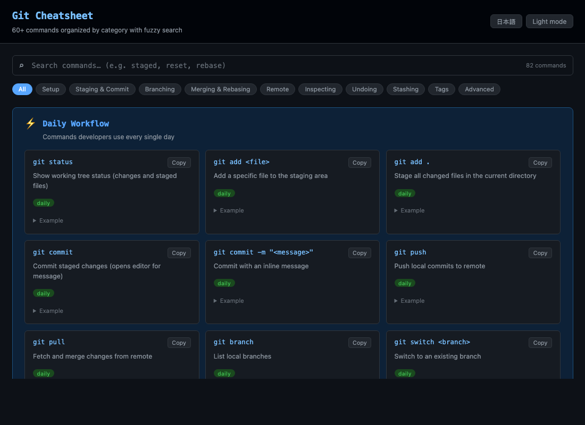

# Git Cheatsheet

[](https://sen.ltd/portfolio/git-cheatsheet/)

60+ の Git コマンドを検索可能なチートシート。カテゴリ別、日英両対応、ファジー検索。

**Live demo**: https://sen.ltd/portfolio/git-cheatsheet/



## 特徴

- 60+ Git commands organized into 10 categories
- Fuzzy search across commands and descriptions
- Japanese / English descriptions
- One-click copy
- Daily workflow highlight
- Terminal-themed UI
- Zero dependencies, no build

## ローカル起動

```sh
npm run serve
```

## テスト

```sh
npm test
```

## ライセンス

MIT. See [LICENSE](./LICENSE).
